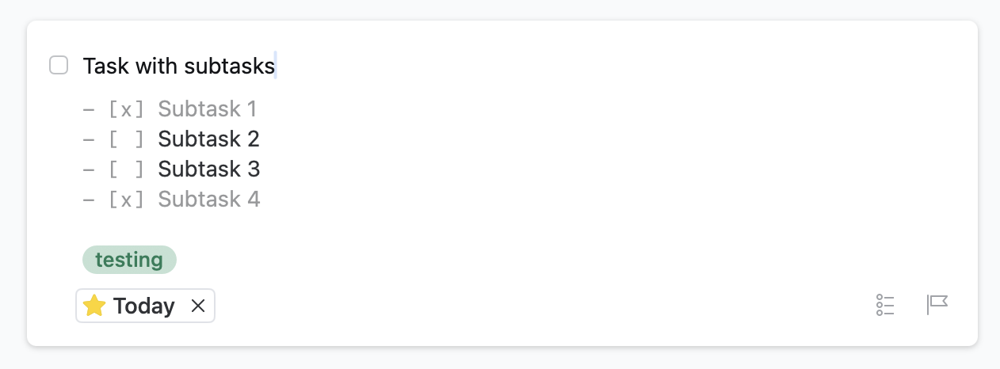

<div align="center">


# Things 3 MCP Server

</div>

This [Model Context Protocol (MCP)](https://modelcontextprotocol.io/introduction) server lets you use Claude Desktop to interact with your task management data in [Things 3](https://culturedcode.com/things). You can ask Claude or your MCP client of choice to create tasks, analyze projects, help manage priorities, and more.

This MCP server leverages a combination of the [Things.py](https://github.com/thingsapi/things.py) library and [Things 3’s AppleScript support](https://culturedcode.com/things/support/articles/4562654/), enabling reading and writing to Things 3.

## Why Things MCP?

This MCP server unlocks the power of AI for your task management:

- **Natural Language Task Creation**: Ask Claude to create richly-detailed tasks and descriptions in natural language
- **Smart Task Analysis**: Let Claude explore your project lists and focus areas and provide insights into your work
- **GTD & Productivity Workflows**: Let Claude help you implement productivity and prioritisation systems
- **Seamless Integration**: Works directly with your existing Things 3 data

## Features

- Access to all major Things lists (Inbox, Today, Upcoming, Logbook, Someday, etc.)
- Project and Area management and assignment
- Tagging operations for tasks and projects
- Advanced search capabilities
- Recent items tracking
- Support for nested data (projects within areas, todos within projects)
- Checklist/Subtask support - Read and display existing checklist items from todos

## Installation

#### Prerequisites
* Python 3.12+
* Claude Desktop
* Things 3 for MacOS

#### Step 1: Install the package

**Option A: Install from PyPI in a virtual environment (recommended)**
```bash
# Create a virtual environment in your home directory
python3 -m venv ~/.venvs/things3-mcp-env
source ~/.venvs/things3-mcp-env/bin/activate

# Install the package
pip install Things3-MCP-server==2.0.2
```

**Option B: Install from source (for development/contributors)**
```bash
# Install uv if you haven't already
curl -LsSf https://astral.sh/uv/install.sh | sh
# Restart your terminal afterwards

# Clone and install the package with development dependencies
git clone https://github.com/rossshannon/Things3-MCP
cd Things3-MCP
uv venv
uv pip install -e ".[dev]"  # Install in development mode with extra dependencies
```

### Step 2: Configure Claude Desktop
Edit the Claude Desktop configuration file:
```bash
code ~/Library/Application\ Support/Claude/claude_desktop_config.json
```

Add the Things server to the mcpServers key in the configuration file:

**Option A: Using PyPI package in virtual environment**
```json
{
    "mcpServers": {
        "things": {
            "command": "~/.venvs/things3-mcp-env/bin/Things3-MCP-server"
        }
    }
}
```

**Option B: Using source installation (for development/contributors)**
```json
{
    "mcpServers": {
        "things": {
            "command": "uv",
            "args": [
                "--directory",
                "/ABSOLUTE/PATH/TO/PARENT/FOLDER/Things3-MCP",
                "run",
                "Things3-MCP-server"
            ]
        }
    }
}
```

### Step 3: Restart Claude Desktop
Restart the Claude Desktop app to enable the integration.

### Sample Usage with Claude Desktop
* “What’s on my todo list today?”
* “Create a todo to prepare for each of my 1-on-1s next week”
* “Evaluate my todos scheduled for today using the Eisenhower matrix.”
* “Help me conduct a GTD-style weekly review using Things.”

#### Tips
* Create a Project in Claude with custom instructions that explains how you use Things and organize areas, projects, tags, etc. Tell Claude what information you want included when it creates a new task (e.g., asking it to include relevant details in the task description, whether to use emojis, etc.).
* Try combining this with another MCP server that gives Claude access to your calendar. This will let you ask Claude to block time on your calendar for specific tasks, create tasks that relate to upcoming calendar events (e.g., prep for a meeting), etc.


### Available Tools

#### List Views
- `get_inbox` - Get todos from Inbox
- `get_today` - Get todos due today
- `get_upcoming` - Get upcoming todos
- `get_anytime` - Get todos from Anytime list
- `get_someday` - Get todos from Someday list
- `get_logbook` - Get completed todos
- `get_trash` - Get trashed todos

#### Basic Operations
- `get_todos` - Get todos, optionally filtered by project
- `get_projects` - Get all projects
- `get_areas` - Get all areas

#### Tag Operations
- `get_tags` - Get all tags
- `get_tagged_items` - Get items with a specific tag

#### Search Operations
- `search_todos` - Simple search by title/notes
- `search_advanced` - Advanced search with multiple filters

#### Time-based Operations
- `get_recent` - Get recently created items

#### Modification Operations
- `add_todo` - Create a new todo with full parameter support
- `add_project` - Create a new project with tags and todos
- `update_todo` - Update an existing todo
- `update_project` - Update an existing project
- `show_item` - Show a specific item or list in Things
- `search_items` - Search for items in Things

## Tool Parameters

### get_todos
- `project_uuid` (optional) - Filter todos by project

### get_projects / get_areas / get_tags
- `include_items` (optional, default: false) - Include contained items

### search_advanced
- `status` - Filter by status (incomplete/completed/canceled)
- `start_date` - Filter by start date (YYYY-MM-DD)
- `deadline` - Filter by deadline (YYYY-MM-DD)
- `tag` - Filter by tag
- `area` - Filter by area UUID
- `type` - Filter by item type (to-do/project/heading)

### get_recent
- `period` - Time period (e.g., '3d', '1w', '2m', '1y')
- `limit` - Maximum number of items to return

### add_todo
- `title` - Title of the todo
- `notes` (optional) - Notes for the todo (supports Markdown formatting including checkboxes like `- [ ] Task`)
- `when` (optional) - When to schedule the todo (today, tomorrow, evening, anytime, someday, or YYYY-MM-DD)
- `deadline` (optional) - Deadline for the todo (YYYY-MM-DD)
- `tags` (optional) - Tags to apply to the todo
- `list_title` or `list_id` (optional) - Title or ID of project/area to add to
- **Note**: While Things’ native checklist feature (i.e., subtasks) cannot be created via AppleScript, you and your LLMs can use Markdown checkboxes in the notes field to achieve similar functionality. 

### update_todo
- `id` - ID of the todo to update
- `title` (optional) - New title
- `notes` (optional) - New notes
- `when` (optional) - When to schedule the todo (today, tomorrow, evening, anytime, someday, or YYYY-MM-DD)
- `deadline` (optional) - Deadline for the todo (YYYY-MM-DD)
- `tags` (optional) - New tags
- `completed` (optional) - Mark as completed
- `canceled` (optional) - Mark as canceled
- `project` (optional) - Name of project to move the todo to (must exactly match an existing project title — look them up with `get_projects`)
- `area_title` (optional) - Title of the area to move the todo to (must exactly match an existing area title — look them up with `get_areas`)

### add_project
- `title` - Title of the project
- `notes` (optional) - Notes for the project
- `when` (optional) - When to schedule the project
- `deadline` (optional) - Deadline for the project
- `tags` (optional) - Tags to apply to the project
- `area_title` or `area_id` (optional) - Title or ID of area to add to (must exactly match an existing area title — look them up with `get_areas`)
- `todos` (optional) - Initial todos to create in the project

### update_project
- `id` - ID of the project to update
- `title` (optional) - New title
- `notes` (optional) - New notes
- `when` (optional) - When to schedule the project (today, tomorrow, evening, anytime, someday, or YYYY-MM-DD)
- `deadline` (optional) - Deadline for the project (YYYY-MM-DD)
- `tags` (optional) - New tags
- `completed` (optional) - Mark as completed
- `canceled` (optional) - Mark as canceled

### show_item
- `id` - ID of item to show, or one of: inbox, today, upcoming, anytime, someday, logbook
- `query` (optional) - Optional query to filter by
- `filter_tags` (optional) - Optional tags to filter by

## Using Tags
Things will automatically create missing tags when they are added to a task or project. Configure your LLM to do a lookup of your tags first before making changes if you want to control this.

## Development

This project uses `pyproject.toml` to manage dependencies and build configuration. It's built using the [Model Context Protocol](https://modelcontextprotocol.io), which allows Claude to securely access tools and data.

### Development Workflow

#### Setting up a development environment

```bash
# Clone the repository
git clone https://github.com/rossshannon/Things3-MCP
cd Things3-MCP

# Set up a virtual environment with development dependencies
uv venv
uv pip install -e ".[dev]"  # Install in development mode with extra dependencies
```

#### Testing changes during development

Run the comprehensive test suite to ensure everything is working as expected:

```bash
# Test the implementation
uv run pytest tests/
```

The tests clean up after themselves and don’t affect your existing data, so you can run them as often as you like.


## Troubleshooting

The server includes error handling for:
- Invalid UUIDs
- Missing required parameters
- Things database access errors
- Data formatting errors
- Authentication token issues
- AppleScript execution failures

### Common Issues

2. **Things app not running**: Make sure the Things app is running on your Mac.

### Checking Logs

All errors are logged and returned with descriptive messages. To review the MCP logs:

```bash
# Follow main logs in real-time
tail -f ~/.things-mcp/logs/things_mcp.log

# Check error logs
tail -f ~/.things-mcp/logs/things_mcp_errors.log

# View structured logs for analysis
cat ~/.things-mcp/logs/things_mcp_structured.json | jq

# Claude Desktop MCP logs
tail -n 20 -f ~/Library/Logs/Claude/mcp*.log
```

## Acknowledgements

This MCP server was originally based on the Applescript bridge method from [things-mcp](https://github.com/excelsier/things-fastmcp) by [excelsier](https://github.com/excelsier/), which was in turn based on [things-mcp](https://github.com/hald/things-mcp) by [hald](https://github.com/hald/).
