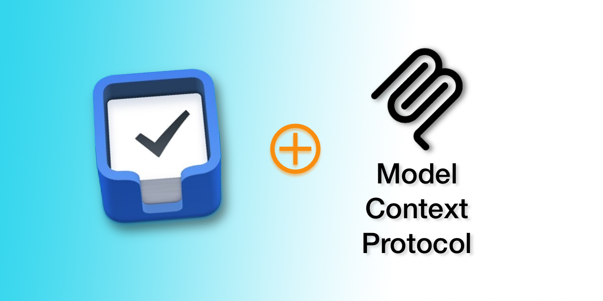

<div align="center">



# Things MCP Server

</div>

This [Model Context Protocol (MCP)](https://modelcontextprotocol.io/introduction) server lets you use Claude Desktop to interact with your task management data in [Things 3](https://culturedcode.com/things). You can ask Claude or your MCP client of choiceto create tasks, analyze projects, help manage priorities, and more.

This MCP server leverages a combination of the [Things.py](https://github.com/thingsapi/things.py) library and [Things 3’s AppleScript support](https://culturedcode.com/things/support/articles/4562654/), enabling reading and writing to Things 3.

## Why Things MCP?

This MCP server unlocks the power of AI for your task management:

- **Natural Language Task Creation**: Ask Claude to create tasks with all details in natural language
- **Smart Task Analysis**: Get insights into your projects and productivity patterns
- **GTD & Productivity Workflows**: Let Claude help you implement productivity systems
- **Seamless Integration**: Works directly with your existing Things 3 data

## Features

- Access to all major Things lists (Inbox, Today, Upcoming, etc.)
- Project and area management
- Tag operations
- Advanced search capabilities
- Recent items tracking
- Detailed item information including checklists
- Support for nested data (projects within areas, todos within projects)

## Installation Options

There are multiple ways to install and use the Things MCP server:

### Option 1: Install from PyPI (Recommended)

#### Prerequisites
* Python 3.12+
* Claude Desktop
* Things 3 for MacOS

#### Installation

```bash
pip install things-mcp
```

Or using uv (recommended):

```bash
uv pip install things-mcp
```

#### Running

After installation, you can run the server directly:

```bash
things-mcp
```

### Option 2: Manual Installation

#### Prerequisites
* Python 3.12+
* Claude Desktop
* Things 3

#### Step 1: Install uv
Install uv if you haven't already:
```bash
curl -LsSf https://astral.sh/uv/install.sh | sh
```
Restart your terminal afterwards.

#### Step 2: Clone this repository
```bash
git clone https://github.com/rossshannon/Things3-MCP
cd Things3-MCP
```

#### Step 3: Set up Python environment and dependencies
```bash
uv venv
uv pip install -r pyproject.toml
```

### Step 4: Configure Claude Desktop
Edit the Claude Desktop configuration file:
```bash
code ~/Library/Application\ Support/Claude/claude_desktop_config.json
```

Add the Things server to the mcpServers key in the configuration file (be sure to update the path to the folder where you installed these files):
```json
{
    "mcpServers": {
        "things": {
            "command": "uv",
            "args": [
                "--directory",
                "/ABSOLUTE/PATH/TO/PARENT/FOLDER/Things3-MCP",
                "run",
                "things_fast_server.py"
            ]
        }
    }
}
```

### Step 5: Restart Claude Desktop
Restart the Claude Desktop app to apply the changes.

### Sample Usage with Claude Desktop
* “What's on my todo list today?”
* “Create a todo to pack for my beach vacation next week, include a packing checklist.”
* “Evaluate my current todos using the Eisenhower matrix.”
* “Help me conduct a GTD-style weekly review using Things.”

#### Tips
* Create a project in Claude with custom instructions that explains how you use Things and organize areas, projects, tags, etc. Tell Claude what information you want included when it creates a new task (e.g., asking it to include relevant details in the task description might be helpful).
* Try adding another MCP server that gives Claude access to your calendar. This will let you ask Claude to block time on your calendar for specific tasks, create todos from upcoming calendar events (e.g., prep for a meeting), etc.


### Available Tools

#### List Views
- `get_inbox` - Get todos from Inbox
- `get_today` - Get todos due today
- `get_upcoming` - Get upcoming todos
- `get_anytime` - Get todos from Anytime list
- `get_someday` - Get todos from Someday list
- `get_logbook` - Get completed todos
- `get_trash` - Get trashed todos

#### Basic Operations
- `get_todos` - Get todos, optionally filtered by project
- `get_projects` - Get all projects
- `get_areas` - Get all areas

#### Tag Operations
- `get_tags` - Get all tags
- `get_tagged_items` - Get items with a specific tag

#### Search Operations
- `search_todos` - Simple search by title/notes
- `search_advanced` - Advanced search with multiple filters

#### Time-based Operations
- `get_recent` - Get recently created items

#### Modification Operations
- `add_todo` - Create a new todo with full parameter support
- `add_project` - Create a new project with tags and todos
- `update_todo` - Update an existing todo
- `update_project` - Update an existing project
- `show_item` - Show a specific item or list in Things
- `search_items` - Search for items in Things

## Tool Parameters

### get_todos
- `project_uuid` (optional) - Filter todos by project
- `include_items` (optional, default: true) - Include checklist items

### get_projects / get_areas / get_tags
- `include_items` (optional, default: false) - Include contained items

### search_advanced
- `status` - Filter by status (incomplete/completed/canceled)
- `start_date` - Filter by start date (YYYY-MM-DD)
- `deadline` - Filter by deadline (YYYY-MM-DD)
- `tag` - Filter by tag
- `area` - Filter by area UUID
- `type` - Filter by item type (to-do/project/heading)

### get_recent
- `period` - Time period (e.g., '3d', '1w', '2m', '1y')
- `limit` - Maximum number of items to return

### add_todo
- `title` - Title of the todo
- `notes` (optional) - Notes for the todo
- `when` (optional) - When to schedule the todo (today, tomorrow, evening, anytime, someday, or YYYY-MM-DD)
- `deadline` (optional) - Deadline for the todo (YYYY-MM-DD)
- `tags` (optional) - Tags to apply to the todo
- `list_title` or `list_id` (optional) - Title or ID of project/area to add to

### update_todo
- `id` - ID of the todo to update
- `title` (optional) - New title
- `notes` (optional) - New notes
- `when` (optional) - New schedule
- `deadline` (optional) - New deadline
- `tags` (optional) - New tags
- `completed` (optional) - Mark as completed
- `canceled` (optional) - Mark as canceled

### add_project
- `title` - Title of the project
- `notes` (optional) - Notes for the project
- `when` (optional) - When to schedule the project
- `deadline` (optional) - Deadline for the project
- `tags` (optional) - Tags to apply to the project
- `area_title` or `area_id` (optional) - Title or ID of area to add to
- `todos` (optional) - Initial todos to create in the project

### update_project
- `id` - ID of the project to update
- `title` (optional) - New title
- `notes` (optional) - New notes
- `when` (optional) - New schedule
- `deadline` (optional) - New deadline
- `tags` (optional) - New tags
- `completed` (optional) - Mark as completed
- `canceled` (optional) - Mark as canceled

### show_item
- `id` - ID of item to show, or one of: inbox, today, upcoming, anytime, someday, logbook
- `query` (optional) - Optional query to filter by
- `filter_tags` (optional) - Optional tags to filter by

## Important Limitations

### Tags
- Tags must exist in Things before they can be applied to todos or projects
- The MCP server will automatically create missing tags when you try to use them
- If tag creation fails, the todo/project will still be created but without tags
- **IMPORTANT**: When using tags in MCP tool calls, always pass them as an array of strings (e.g., `["tag1", "tag2"]`) NOT as a comma-separated string. Passing as a string will treat each character as a separate tag.

### Authentication Token
- Required for all URL scheme operations (create, update, delete)
- Without a token, Things will prompt for authentication on each operation

## Authentication Token Configuration

The Things MCP server requires an authentication token to interact with the Things app. This token is used to authorize URL scheme commands.

### How to get your Things authentication token

1. Open Things app on your Mac
2. Go to Things → Preferences (⌘,)
3. Select the General tab
4. Make sure "Enable Things URLs" is checked
5. Look for the authentication token displayed in the preferences window

### Configuring the token

Run the included configuration tool to set up your token:

```bash
python configure_token.py
```

This interactive script will prompt you for your token and save it securely in your local configuration.

## Development

This project uses `pyproject.toml` to manage dependencies and build configuration. It's built using the [Model Context Protocol](https://modelcontextprotocol.io), which allows Claude to securely access tools and data.

### Implementation Options

This project provides two different implementation approaches:

1. **Standard MCP Server** (`things_server.py`) - The original implementation that uses the basic MCP server pattern.

2. **FastMCP Server** (`things_fast_server.py`) - A modern implementation using the FastMCP pattern for cleaner, more maintainable code with decorator-based tool registration.

### Development Workflow

#### Setting up a development environment

```bash
# Clone the repository
git clone https://github.com/rossshannon/Things3-MCP
cd Things3-MCP

# Set up a virtual environment with development dependencies
uv venv
uv pip install -e ".[dev]"  # Install in development mode with extra dependencies
```

#### Testing changes during development

Use the MCP development server to test changes:

```bash
# Test the FastMCP implementation
mcp dev things_fast_server.py

# Or test the traditional implementation
mcp dev things_server.py
```

#### Building the package for PyPI

```bash
python -m build
```

#### Publishing to PyPI

```bash
twine upload dist/*
```

Requires Python 3.12+.

## Reliability Features

### Monitoring & Debugging
- **Structured Logging**: JSON-formatted logs for better analysis
- **Operation Tracking**: Each operation is logged with timing and status
- **Comprehensive Error Handling**: Graceful handling of Things database access errors
- **Log Locations**:
  - Main logs: `~/.things-mcp/logs/things_mcp.log`
  - Structured logs: `~/.things-mcp/logs/things_mcp_structured.json`
  - Error logs: `~/.things-mcp/logs/things_mcp_errors.log`

## Troubleshooting

The server includes error handling for:
- Invalid UUIDs
- Missing required parameters
- Things database access errors
- Data formatting errors
- Authentication token issues
- Network timeouts
- AppleScript execution failures

### Common Issues

2. **Things app not running**: Make sure the Things app is running on your Mac.

### Checking Logs

All errors are logged and returned with descriptive messages. To review the MCP logs:

```bash
# Follow main logs in real-time
tail -f ~/.things-mcp/logs/things_mcp.log

# Check error logs
tail -f ~/.things-mcp/logs/things_mcp_errors.log

# View structured logs for analysis
cat ~/.things-mcp/logs/things_mcp_structured.json | jq

# Claude Desktop MCP logs
tail -n 20 -f ~/Library/Logs/Claude/mcp*.log
```
